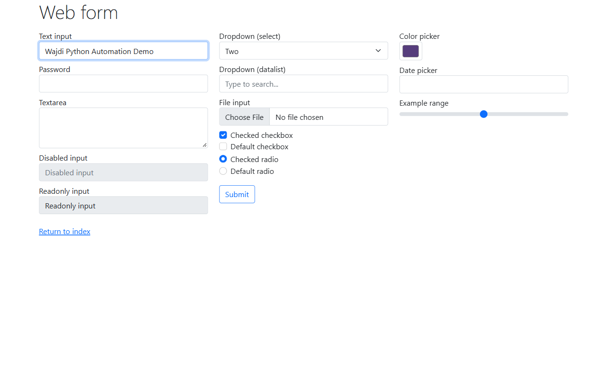

# Playwright Automation Demo

A small Python browser-automation demonstration built with Playwright.

This project demonstrates practical browser automation capabilities relevant to web portals, repetitive data-entry workflows, data extraction, and API-connected automation systems.

## What the Demo Does

The script automatically:

1. Launches a Chromium browser.
2. Opens a public test web form.
3. Waits for the required page elements.
4. Enters text into the form.
5. Selects an option from a dropdown.
6. Checks a checkbox.
7. Captures a screenshot before submission.
8. Submits the form.
9. Waits for and extracts the response message.
10. Captures the final result.
11. Saves structured execution results.
12. Includes timeout and exception handling.

## Technologies

- Python
- Playwright
- Chromium
- JSON
- Automated screenshots
- Logging and error handling

## Installation

Install Playwright:

```bash
pip install playwright
```

Install Chromium:

```bash
python -m playwright install chromium
```

## Run

```bash
python demo.py
```

## Example Output

A successful execution produces:

```text
Status: SUCCESS
Submitted value: Wajdi Python Automation Demo
Response: Received!
```

## Screenshots

### Automated Form Filling



### Successful Submission


## Real-World Extension

The same architecture can be extended for production automation workflows including:

- Web portal navigation
- Form filling
- Structured data extraction
- Dynamic page handling
- Authentication/session workflows
- Retry and timeout management
- API integrations
- CRM integrations
- Automated data validation
- Logging and failure recovery

For production systems, selectors, credentials, API configuration, retry policies, and workflow rules can be separated from the core automation logic for easier maintenance and deployment.

## Author

Wajdi Mohammed Saloul
